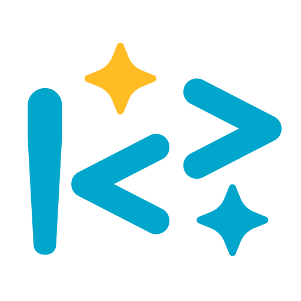

# Concerto AutoAgent — 智能任務代理服務

## 🧠 服務簡介

Concerto AutoAgent 是由 OKmotivation.co 以及 !<? Studio 所開發之情境智能任務代理系統，  
支援 LINE 通知、任務流程自動化與智能服務角色切換。

---

## 🔐 法律與使用政策

請參考下列連結：

- [服務條款 Terms of Service](./terms_of_service_OKmotivation.md)
- [隱私權政策 Privacy Policy](./privacy_policy_OKmotivation.md)
- [模組識別與授權說明](./LICENSE_invitation_only.txt)

---

## 🧾 標章識別與原創聲明

本專案中所使用之 `!<? Studio` 標誌與圖形識別（包含藍綠色驚嘆號與雙箭號符號組合），  
為創作者 Kyle 專屬設計之 AutoAgent 視覺標記，代表其個人工具、智能代理與開發模組之識別系統。

本標章與其所屬名稱、設計語言、模組結構、腳本邏輯（包含但不限於 AAxGC、AutoAgent Root Hub、Concerto_Engine 等），  
皆屬創作者專案體系之一部分，具有原創識別性與系統連貫性。

### 🚫 禁止用途

- 未經授權，不得擅自使用、仿作、散佈或商業化本專案之任何一部份（視覺標誌、腳本邏輯、語義結構等）  
- 不得混用於任何與第三方品牌、商業產品或外部服務相混淆之場景  
- 嚴禁以本模組為基礎發表未經標註作者之衍生專案  

### ✅ 合作與使用

如需使用、引用、改作或共同開發相關設計與模組，請先取得創作者書面授權。  
📧 授權洽談：info@okmotivation.com

---

© 2025 !<? Studio / OKmotivation.co — All rights reserved.  
本頁面與內容由 OKmotivation.co 團隊與 !<? Studio 共同設計與維護。  
未經授權禁止轉載、重製、仿作或商業使用。

This visual and programmatic identity is not affiliated with or endorsed by OpenAI or LINE.
